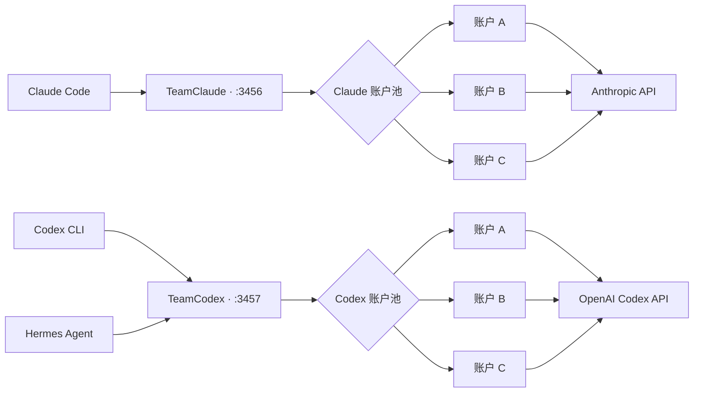

<p align="center">
  <a href="README.md">English</a> ·
  <a href="README.ko.md">한국어</a> ·
  <strong>简体中文</strong>
</p>

<p align="center">
  
</p>

<h1 align="center">TeamClaude · TeamCodex</h1>

<p align="center">
  <strong>一个本地代理，连接所有编程账户，让会话不中断。</strong>
</p>

<p align="center">
  通过相互独立的多账户池运行 Claude Code 与 OpenAI Codex CLI。<br>
  支持配额感知路由、即时故障转移和实时终端仪表盘。
</p>

<p align="center">
  
  
  
  <a href="LICENSE"></a>
</p>

<p align="center">
  <a href="#快速开始"><strong>快速开始</strong></a> ·
  <a href="#codex-多账户配置"><strong>Codex 配置</strong></a> ·
  <a href="#实时仪表盘"><strong>仪表盘</strong></a> ·
  <a href="#工作原理"><strong>架构</strong></a>
</p>

> [!NOTE]
> Claude 与 Codex 分别使用独立的配置文件、端口和账户池。两个代理可以同时在线，Codex CLI 与 Hermes Agent 始终连接同一个稳定的本地地址。

## 安装

```bash
npm i -g github:sangrokjung/teamclaude

teamclaude import         # 读取已有的 Claude Code 登录
teamcodex codex import    # 读取已有的 ~/.codex/auth.json
teamclaude server         # 启动代理，然后执行 `teamclaude run`
```

这样安装的是默认分支。`npm i -g teamcodex` 也能用，但 registry 上的版本是
**1.1.0（2026-07-29）**，而本分支已经走得远得多：那个版本里没有 BYOK 表面、
Codex 重置额度、账户重新认证，也没有 401 级联防护。除非你确实需要那个旧版本，
否则请从仓库安装。

本包会装上**两个命令**，用哪一个决定了你连的是哪个池子：

| 命令 | 池子 | 配置 |
|---|---|---|
| `teamclaude …` | Claude（Anthropic） | `~/.config/teamclaude.json`，端口 3456 |
| `teamcodex codex …` | Codex（ChatGPT） | `~/.config/teamcodex.json`，端口 3457 |

`teamclaude` 存在的意义就是不会被劫持：它在做任何事之前先清掉继承来的
`TEAMCLAUDE_PROVIDER`，所以残留在 shell 里的值、launchd plist，或者
`teamcodex run` 的子进程，都无法把一条 Claude 命令悄悄指向 Codex 池。
`teamcodex` 则相反，它尊重那个变量，这正是 `teamcodex codex …` 能选中 Codex
一侧的原因。两条契约都由 `test/entry-point.test.js` 锁定。注意上游的
`@karpeleslab/teamclaude` 同样会安装一个 `teamclaude` 二进制，不要两个都装。

账号请用**你自己的**。用你自己付费的 Claude 和 ChatGPT 订阅登录即可。本工具只是在
你自己的登录之间轮换，不是用来让多人共用一个席位的。

## 关于使用条款

**本项目仅用于管理你自己拥有的账号，不支持也不鼓励账号共享、代充或转售。**

> **本 fork 增加了一个例外。** 可选的 BYOK 表面（见下文*BYOK 表面*）会把**第三方**
> 客户端的请求整形成上游对一方客户端所期待的形状后转发。这超出了下面"同一客户端、
> 你自己的会话"的论证范围。它默认关闭，是否启用由你自己决定，风险也由你承担。

它做的事情，就是把你手动切换自己账号的动作自动化。每个请求都带该账号自身的
OAuth token，也不会为第三方做任何中转。凭证保存在本地，只会发往官方 API，
与 CLI 原本的发送目标完全相同，第三方无法接触到它。

池子跑在一台机器上。从你自己的另一台设备连过去（比如走私有隧道）依然是你自己的
账号、你自己的会话，runbook 也是按这种拓扑写的。不支持的是第二个**人**：界线在于
请求由谁的订阅签名，而不在于你有几台机器接进来。

它不会增加你的额度，也不会绕过任何限制。它只是让你已经付费的额度不至于白白过期。

顺带一提，Claude Code 自身的 `/extra-usage` 流程在触及限额时，就会提示你登录**自己名下的另一个账号**。
"换成我自己的另一个账号继续工作"本来就是官方客户端主动提供的操作，本项目只是把这个切换自动化，
省去手动点击。

如果是团队使用，每个成员仍然用自己的订阅登录。多人共用一个席位不在支持范围内。
如果官方明确表示不允许这类工具，本项目会相应调整功能或停止维护。

## 与上游项目的关系

Fork 谱系：[KarpelesLab/teamclaude](https://github.com/KarpelesLab/teamclaude) →
[jung-wan-kim/teamclaude](https://github.com/jung-wan-kim/teamclaude) → 本仓库。
页面顶部的 fork 标识只显示直接上级，所以显示的是 jung-wan-kim 而不是原作者。

本项目 fork 自 [KarpelesLab/teamclaude](https://github.com/KarpelesLab/teamclaude)。
上游在 Claude 侧的实现非常扎实，值得单独使用。这个分支是因为需要**Codex（ChatGPT OAuth）
多账号池**才走了另一条路，上游并未覆盖这部分，此外还加了模型降级链和网络层故障转移。
上游也有本分支没有的功能，按自己的场景选择即可。

## 实时仪表盘

<p align="center">
  
</p>

<p align="center"><sub>使用脱敏演示账户渲染的真实 TeamCodex TUI 布局。</sub></p>

## 为什么需要它？

AI 编程订阅的会话限额和每周限额按账户分别计算。某个账户达到限额时，
长时间运行的终端不应该因此中断。TeamClaude 与 TeamCodex 让客户端始终
连接同一个本地地址，并自动把新请求切换到最合适的可用账户。

<table>
  <tr>
    <td width="50%">
      <strong>⚡ 无缝故障转移</strong><br>
      遇到配额、速率、网络或上游故障时，无需修改客户端命令即可切换账户。
    </td>
    <td width="50%">
      <strong>🧭 配额感知路由</strong><br>
      优先使用每周配额最早重置的账户，避免即将刷新却尚未使用的额度被浪费。
    </td>
  </tr>
  <tr>
    <td width="50%">
      <strong>🧠 缓存友好的连接亲和性</strong><br>
      连续对话保持在同一账户上，仅在并发溢出时把请求分散到其他账户。
    </td>
    <td width="50%">
      <strong>🖥️ 可人工操作</strong><br>
      可在 TUI 中查看用量、切换账户、禁用异常账户并调整优先级。
    </td>
  </tr>
</table>

## 主要功能

- **Use-or-lose 优先级** — 优先使用每周配额最早重置的账户。
- **Codex 订阅账户池** — 单独管理 ChatGPT OAuth 账户并追踪官方 Codex 用量响应头。
- **429 即时故障转移** — 暂时排除配额耗尽的账户，并把请求发送到下一个账户。
- **连续性模式** — quota 或 transient/global 429 会在默认 15 分钟 deadline 内由代理恢复，probe 间隔最多 30 秒。
- **连接亲和性** — 同一终端的连续请求尽量停留在同一账户，保留 prompt cache。
- **并发请求分散** — 超出单账户并发上限的流量自动分散到其他账户。
- **Fable/Mythos 账户优先** — 只有模型级窗口仍在有效期内、数值有限且已达到上限（fresh、finite、full）的账户才会对当前请求被跳过；未测量、已过期或仍可用的账户会先尝试原模型，Opus/Sonnet/Haiku 的资格不受影响。
- **模型 fallback** — 当缓存中的 general-available 账户对该模型全部 fresh-full，或实时 labeled model-tier 429 已覆盖所有 eligible 账户时切换到备用模型。Claude Code advisor 请求以 root `tools[]` 中 `advisor_*` 项的嵌套模型作为路由依据，fallback 也只改写该嵌套 `model`，不会改动 top-level executor；无 label 的 global 429、local cap 或并发 queue 都不会更换模型。
- **BYOK 表面（本 fork 独有）** — 开启 `/byok` 路径前缀后，支持"自带 key"的第三方客户端（编辑器插件、AI 浏览器、你自己的脚本）也能使用这个池子。代理会把请求整形成上游对一方客户端所要求的形状，并去掉会被拒绝的浏览器上下文头，而走 `/v1/*` 的 Claude Code 流量字节完全不变。不配置就是关闭状态，启用前请先读使用条款一节。
- **实时 TUI** — 显示账户状态、会话与每周用量、重置时间以及 CPU、内存。
- **手动账户控制** — 通过 CLI 或 TUI 执行 enable、disable、switch 和 priority。
- **重启后恢复状态** — 将用量和 throttle 状态保存在独立的 quota 文件中。
- **Active warm-up** — 复用真实请求格式，以最小请求快速测量各账户的用量。
- **OAuth 自动刷新** — 自动刷新即将过期的认证信息，并通过后台定期扫描刷新闲置和已禁用账户，避免 refresh 链失效。
- **安全的内部重试边界** — 只在代理内部重试可安全重发的请求；结果不确定的 POST 不做隐藏重发，而是返回可重试的错误。
- **资源上限** — 对请求、响应缓冲区和等待时间设置上限，过载时代理也不会卡死。
- **零运行时依赖** — 仅使用 Node.js 内置模块。

## 快速开始

需要 Node.js 18 或更高版本。

```bash
# 安装默认分支（npm 上的版本较旧——见上文"安装"一节）
npm install -g github:sangrokjung/teamclaude

# 添加 Claude 账户——会打开浏览器 OAuth
teamclaude login
teamclaude login

# 启动 Claude 代理
teamclaude server

# 在另一个终端中运行 Claude Code
teamclaude run
```

> [!IMPORTANT]
> 即使代理正在运行，普通的 `claude` 命令也不会自动使用代理。若要启用账户自动切换，请始终通过 `teamclaude run` 启动。
> `teamclaude run` 会在代理缺失时自动启动后台 supervisor。即使 proxy worker 异常退出，public listener 仍会保持，并自动启动新的 worker。
> `launchModel` fallback 仅在所有按通用限额仍可用的账户，其模型级窗口都具有有效测量且已达到上限时应用。只要存在未测量或已过期的窗口，就不会提前 downgrade。

也可以导入 Claude Code 当前的登录信息：

```bash
claude /login
teamclaude import
```

## Codex 多账户配置

Codex 使用 `~/.config/teamcodex.json` 和默认端口 `3457`。
Claude 代理默认使用端口 `3456`，因此两个服务器可以同时运行。

```bash
# 在彼此隔离的 CODEX_HOME 中执行官方 Codex OAuth
teamclaude codex login --name codex-pro-1
teamclaude codex login --name codex-pro-2

# 启动 Codex 代理和仪表盘
teamclaude codex server

# 在另一个终端中运行 Codex CLI
teamclaude codex run

# 非交互式运行
teamclaude codex run -- exec "summarize this repository"
```

也可以导入当前登录到官方 Codex CLI 的账户：

```bash
codex login
teamclaude codex import --name codex-pro-1
```

推荐使用 `teamclaude codex login`。该流程在临时 `CODEX_HOME` 中完成登录，
可以避免 TeamCodex 与普通 `~/.codex/auth.json` 同时轮换同一个 refresh
token 而发生冲突。

### Codex 账户控制

```bash
teamclaude codex status
teamclaude codex accounts
teamclaude codex disable codex-pro-1
teamclaude codex enable codex-pro-1
teamclaude codex priority codex-pro-2 0
teamclaude codex restart
```

## 连接 Hermes Agent

启动 TeamCodex 后，把 Hermes 的 Codex provider 指向本地代理：

```yaml
# ~/.hermes/config.yaml
model:
  default: gpt-5.6-sol
  provider: openai-codex
  base_url: http://127.0.0.1:3457
```

如果 Hermes 的 credential pool 中已有 `openai-codex` 条目，也请把每个条目的
`base_url` 设置为同一个本地地址。修改配置后重启 Hermes gateway。Hermes
只连接一个固定地址，实际账户的选择、刷新与切换均由 TeamCodex 负责。

## 添加账户

### OAuth 登录

```bash
teamclaude login
```

### 从 Claude Code 导入

```bash
teamclaude import
teamclaude import --name work
```

### API key 账户

```bash
teamclaude api --name production
```

## 服务器与仪表盘

```bash
teamclaude server
teamclaude status
teamclaude accounts
teamclaude stop
teamclaude restart
```

在 TTY 中运行 `teamclaude server` 或 `teamclaude codex server` 时，
会打开全屏仪表盘。

| 按键 | 操作 |
|---|---|
| `↑` / `↓` | 选择账户 |
| `s` | 切换到所选账户 |
| `e` | 启用或禁用所选账户 |
| `o` | 进入优先级移动模式 |
| `a` | 将全部优先级恢复为自动模式 |
| `c` | 清除所选账户的固定优先级 |
| `d` | 删除账户 |
| `R` | 重新加载配置并重新测量用量 |
| `q` | 退出 |

## 基础配置

Claude 配置文件为 `~/.config/teamclaude.json`，Codex 配置文件为
`~/.config/teamcodex.json`。实际文件以 `0600` 权限保存。

```json
{
  "proxy": {
    "host": "127.0.0.1",
    "port": 3456
  },
  "upstream": "https://api.anthropic.com",
  "switchThreshold": 0.98,
  "reevalIntervalMs": 300000,
  "maxConcurrentPerAccount": 3,
  "sessionAffinity": true,
  "continuityMode": true,
  "continuityMaxWaitMs": 900000,
  "continuityMaxSleepMs": 30000,
  "activeWarmup": true,
  "autoResumeClaude": true,
  "codexFallbackOnExhaustion": false,
  "cmuxSessionRescue": false,
  "cmuxSessionRescueIntervalMs": 1000,
  "accounts": []
}
```

| 配置项 | 说明 |
|---|---|
| `switchThreshold` | 将账户视为已满的使用率阈值 |
| `reevalIntervalMs` | 重新评估 sticky 账户优先级的间隔 |
| `maxConcurrentPerAccount` | 单个账户的最大并发上游请求数 |
| `sessionAffinity` | 将同一连接保持在原账户 |
| `continuityMode` | 在 deadline 内部恢复 quota 或 transient/global 429 |
| `continuityMaxWaitMs` | 连续性内部恢复的总 deadline（默认 `900000` = 15 分钟） |
| `continuityMaxSleepMs` | 连续性 probe 之间的最大间隔（默认 `30000` = 30 秒） |
| `activeWarmup` | 通过最小请求预先测量账户用量 |
| `autoResumeClaude` | 将 TeamClaude 启动的 Claude 会话在 timeout/429 后自动恢复为同一会话 |
| `codexFallbackOnExhaustion` | 仅在确认没有备用 Claude 账户或全部通用 quota 耗尽时转交 Codex |
| `cmuxSessionRescue` | 检测现有 cmux Claude 会话的精确 `Login expired`，保留原 pane，并在同一 window 的新非聚焦 workspace 中恢复 |
| `cmuxSessionRescueIntervalMs` | 检查现有 cmux 会话恢复的间隔（最小 500ms，默认 1000ms） |
| `accounts[].enabled` | 设为 `false` 时从轮换中排除账户 |
| `accounts[].priority` | 数字越小，固定优先级越高 |
| `modelFallbacks` | 各模型的备用模型链 |
| `streamRecovery` | 按事件边界转发 SSE，并把中断的流收尾为可重试的错误 |
| `tokenRefreshIntervalMs` | 闲置账户 OAuth 刷新扫描间隔（`0` = 关闭） |

`cmuxSessionRescue` 仅在仅限所有者访问的 registry/transcript、精确的
session selector 与进程启动时间、受信任的 Claude 可执行文件以及实时
cmux surface→workspace 拓扑全部一致时运行。它会先在磁盘上写入每个会话的
claim，因此 supervisor 重启或 workspace 创建结果不确定时也不会重复启动
同一会话。

缓冲区、超时上限等完整配置项请参阅[英文 README](README.md#configuration)。

### BYOK 表面（本 fork 独有）

支持"自带 key"（BYOK）的第三方客户端无法走本代理的常规路径。上游会拒绝两类请求：
形状不符合一方客户端预期的，以及带浏览器上下文头的。客户端在自己的 provider 配置里
无法解决其中任何一个，所以代理**只在一个专用路径前缀上**替它补齐。

启用前先定两件事。

一是读本文档前面的"关于使用条款"。与代理的其他部分不同，这个表面转发的是第三方
客户端的流量。二是它交给那个客户端的池子，是**你自己的订阅**。这个表面的存在，是为了
让你的浏览器或编辑器也能用上你已经付费的账号，而不是为了把一个 URL 加一把 key 传来
传去。拿到这两样的人，花的都是你自己登录下的额度。

它还需要默认分支的构建（`npm i -g github:sangrokjung/teamclaude`）。npm 上的发布版本
早于这个表面，里面根本没有相关代码。

```json
{
  "byok": {
    "enabled": true,
    "prefix": "/byok",
    "apiKey": "byok-change-me-to-a-secret",
    "minUsableAccounts": 2,
    "maxConcurrent": 2
  }
}
```

1. 把 `apiKey` 换成你自己的密钥（`openssl rand -base64 24`）。上面这个占位值是
   **刻意会被拒绝**的，原样复制粘贴只会让表面保持关闭。
2. 让 `minUsableAccounts` 与你的池子匹配。它是 BYOK 被放行前必须越过的下限，
   所以在只有一个可用账号时，默认值 `2` 会拒绝掉每一个 BYOK 请求，看起来像坏了，
   其实是按配置工作。池子小就设成 `1`，或者设成 `0` 表示无条件放行，代价是失去
   那层保护 Claude Code 不受影响的余量。
3. 执行 `teamclaude restart`。BYOK 配置只在服务器启动时解析一次，TUI 的 **R** 重载
   只会重新同步账号，表面仍然是关的。
4. 把客户端的 base URL 指向 `http://127.0.0.1:3456/byok`，API key 填那个密钥。

是否生效看 `/teamclaude/status` 里有没有 `byok` 对象
（`inflight`/`admitted`/`rejected`/`injected`）。三种不同的失败会收敛成很相似的状态，
所以要把 key 和日志**一起**看：

| status 里的 `byok` | 日志 | 含义 |
|---|---|---|
| 整个键**不存在** | 不可能出现 | 你的构建早于这个表面。改配置不会让它出现，请从默认分支重新安装。 |
| `null` | `[TeamClaude] BYOK surface disabled: ...` | 配置被拒绝了。那一行会写明原因：没有 `apiKey`、用了 `config.example.json` 里的占位 key、key 不足 20 字符，或者 `prefix` 为空、是根路径、或以代理自己占用的段（`/v1`、`/teamclaude`）开头。改完重启即可。 |
| `null` | **没有这行** | 代理从来没看到一个已启用的块——要么它读到的配置里没有 `byok`，要么 `enabled` 不是严格的 `true`。这两种情况按设计都会静默跳过。请确认你改的是那个池子真正读取的配置文件（Claude 一侧是 `~/.config/teamclaude.json`，不是 `teamcodex.json`），并且保存后重启了。 |

第三行最常见，也最容易被误读成第二行：块缺失或没写 `enabled` 时得到的是
`{ enabled: false, error: null }`，而日志只在有 `error` 可报时才出声。

需要留意的几点：

- 现有的 Claude Code 流量走 `/v1/*`，**在结构上进不了**这条整形通道，字节完全不变。
- 预检对任何 origin 都会响应，但真实响应里没有 CORS 头，所以浏览器渲染进程的
  `fetch()` 仍然读不到结果。请从后台进程、扩展或主进程调用。
- 这个表面前面挂的是真实订阅凭证，所以过短的 key 和默认 key 会被拒绝，
  控制平面路径一律 404。

完整行为与安全护栏以[英文 README](README.md#byok-surface-fork) 的 *BYOK surface (fork)*
一节为准，Aside 浏览器的完整接入示例也在那里。

## 工作原理



1. 客户端连接本地代理，而不是直接连接服务商 API。
2. 代理从可用账户中选择优先级最高的账户。
3. 距离过期不足 5 分钟的 OAuth token 会在请求前自动刷新。
4. 代理从响应头学习会话、每周和模型级用量及其重置时间。模型级窗口不会在重启时恢复，因此从未测量（unknown）开始；runtime 中只有仍在有效期内、数值有限且已达到上限（fresh、finite、full）的窗口，才会对对应的 Fable/Mythos 请求排除该账户。只要按通用限额仍可用的账户中有一个窗口未测量、已过期或仍可用，就保留原模型，Opus/Sonnet/Haiku 的资格不变。
5. 新启动的服务器会优先轮询尚未测量的账户。
6. 配额型 429 会立即排除当前账户并切换到其他账户。
7. 速率或并发型 429 只进行有限次数的分散，不会污染账户状态。耗尽 failover budget 后仍存在的无 label transient/global 429 会保持原模型，并在 `continuityMaxWaitMs` deadline 内部恢复。local cap 或并发 queue 也不会触发 fallback。
8. 网络错误或不完整的 SSE 流，只有可安全重发的请求才会在内部换账户重试；结果不确定的 POST 不做隐藏重发，而是返回可重试的错误。
9. 模型 fallback 只有两个入口：缓存中的 general-available 账户全部 fresh-full，或实时 labeled model-tier 429 已覆盖所有 eligible 账户。无 label 的 global 429 不是 fallback 依据。cached fresh-full 路径会在连续性 sleep 前立即执行；其他情况下，当所有账户都受限时，连续性模式会在默认 15 分钟 deadline 内以最多 30 秒的间隔尝试恢复原模型。
10. 普通用量状态会在重启后恢复，但模型级用量不会恢复，而是通过真实流量重新测量。

## 安全提示

- 请勿把包含真实认证信息的配置文件提交到 Git。
- 远程客户端必须通过 `x-api-key` 认证。
- 默认只信任来自 localhost 的本地请求。
- 启用请求日志时，认证信息仍会被遮罩。

## 许可证

MIT
